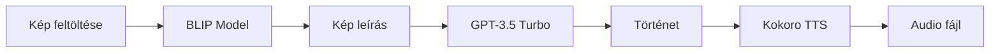

# Multimodal-ai-modell | 🎨 Image to Audio Story
Multimodális feladatmegoldás neurális hálókkal


## 🔗 Linkek és Demók

| 🚀 IT Betyár Demo | 💻 GitHub Repository | 🤗 Hugging Face Demo | 🎓 AI Tanfolyam |
|:---:|:---:|:---:|:---:|
| [](https://itbetyar.hu/project/multimodal-ai-modell/) | [](https://github.com/itbetyar/Multimodal-ai-modell/) | [](https://huggingface.co/spaces/itbetyar/5-image-to-story) | [](https://itbetyar.hu/mesterseges-intelligencia-fejleszto-tanfolyam/) |

---
⭐ Ha tetszik a projekt, adj neki egy csillagot a GitHub-on!
---

- Multimodal AI alkalmazás, amely egy képből automatikusan generál audio történetet.
- Az app 3 különböző AI modellt használ:
    - képfelismerést(image-to-text), szöveggenerálást(text-to-text) és beszédszintézist(text-to-speech).
 

## 🌟 Funkciók

- **Képfelismerés** - BLIP modell segítségével szöveges leírást generál a képről
- **Történetgenerálás** - ez alapján a GPT-3.5 Turbo használatával kreatív rövid történetet ír
- **Beszédszintézis** - ebből Text-to-Speech technológiával audio formátumba konvertálja a történetet
- **Intuitív felület** - Streamlit alapú, felhasználóbarát webes interfész


## 🚀 Használt technológiák

### AI Modellek
1. **Salesforce BLIP** - Image Captioning (kép → szöveg)
2. **OpenAI GPT-3.5 Turbo** - Story Generation (szöveg → történet)
3. **Kokoro-82M** - Text-to-Speech (szöveg → hang)

### Keretrendszerek és könyvtárak 
- `streamlit` - Webes felület
- `transformers` - Hugging Face modellek
- `openai` - OpenAI API
- `huggingface_hub` - Inference API
- `Pillow` - Képfeldolgozás

## 📋 Előfeltételek

- Python 3.8 vagy újabb
- OpenAI API kulcs
- Hugging Face API kulcs

## 🔧 Telepítés

1. **Repository klónozása**
```bash
git clone https://github.com/yourusername/image-to-audio-story.git
cd image-to-audio-story
```

2. **Függőségek telepítése**
```bash
pip install -r requirements.txt
```

3. **Környezeti változók beállítása**

Hozz létre egy `.env` fájlt a projekt gyökérkönyvtárában alábbi tartalommal:
```env
OPENAI_API_KEY=your_openai_api_key_here
HUGGING_API_KEY=your_hugging_face_api_key_here
```


## 🎯 Használat

1. **Alkalmazás indítása**
```bash
streamlit run app.py
```

2. **Böngészőben nyisd meg** a megjelenő URL-t (általában `http://localhost:8501`)

3. **Tölts fel egy JPG képet** a feltöltő gombbal

4. **Várd meg a feldolgozást:**
   - A rendszer automatikusan elemzi a képet
   - Generál egy rövid történetet
   - Létrehozza az audio verziót

5. **Hallgasd meg az eredményt** az audio lejátszóval

## 📁 Projekt felépítés

```
image-to-audio-story/
│
├── app.py                    # Fő alkalmazás fájl
├── mulimodal_cover.webp      # Borítókép
├── requirements.txt          # Python függőségek
├── README.md                 # Dokumentáció
└── .env                      # API kulcsok
```

## 📦 requirements.txt

```txt
streamlit>=1.31.0
transformers>=4.36.0
openai>=1.10.0
huggingface-hub>=0.20.0
Pillow>=10.2.0
torch>=2.1.0
```

## 🔄 Működési folyamat



1. **img2story()** - A feltöltött képet elemzi és szöveges leírást generál
2. **generate_story()** - A leírásból max. 20 szavas történetet ír
3. **text2speech()** - A történetet FLAC formátumú audio fájllá alakítja

## ⚙️ Konfiguráció

Az alkalmazás testreszabható paraméterei:

- **Történet hossza**: A `generate_story()` függvényben módosítható a "no more than 20 words" érték
- **Modell**: A GPT-3.5-turbo lecserélhető GPT-4-re jobb minőségért
- **TTS modell**: A Kokoro-82M helyettesíthető más text-to-speech modellel


## 📝 Licensz

Ez a projekt oktatási célokat szolgál és az IT Betyár (itbetyar.hu) által készült.

## 👨‍💻 Szerző

**IT Betyár**
- Website: [itbetyar.hu](https://itbetyar.hu)
- Készítve: 2024.04
- Frissítve: 2026.02


## 📧 Kapcsolat

Kérdések vagy javaslatok esetén látogass el az [itbetyar.hu](https://itbetyar.hu) oldalra.

---

⭐ Ha tetszik a projekt, adj neki egy csillagot a GitHub-on!
